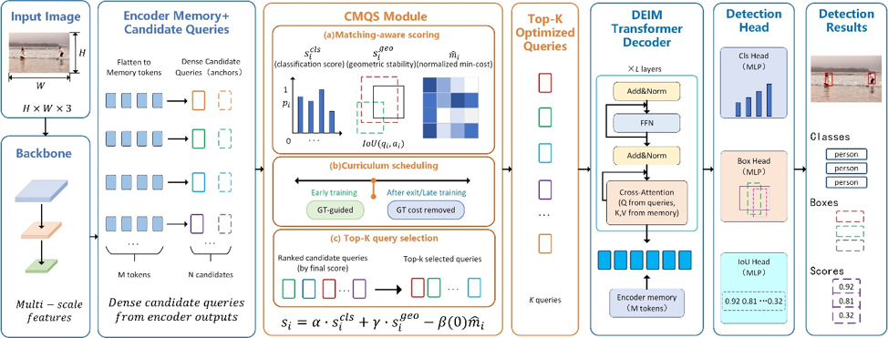

# Curriculum Matching-Aware Query Selection for Efficient End-to-End Object Detection

This repository provides the implementation package for **Curriculum Matching-Aware Query Selection (CMQS)** for efficient end-to-end object detection. CMQS improves decoder query selection in DEIM-style detectors by aligning the query ranking criterion with the subsequent matching-based supervision objective.



## Relation to DEIM

This implementation is built upon the official **DEIM: DETR with Improved Matching for Fast Convergence** codebase. CMQS keeps the original DEIM backbone, encoder, decoder layers, Dense O2O training strategy, Matchability-Aware Loss, detection heads and inference post-processing unchanged. The core modification is introduced before decoder query construction: encoder candidate queries are ranked using classification confidence, geometric stability and curriculum matching-cost guidance.

CMQS uses GT-cost guidance only during early training. In the paper notation, the exit epoch is denoted as \(T_{exit}\). In the implementation, it corresponds to:

```yaml
query_select_gt_stop_epoch: 10
```

When the current epoch satisfies `epoch >= query_select_gt_stop_epoch`, GT-cost guidance is disabled. During inference, no ground-truth information is used.

## Repository Structure

```text
.
├── configs/deim_dfine/
│   ├── deim-l-cmqs.yml          # DEIM-L + CMQS main setting
│   ├── deim-l-baseline.yml      # local DEIM-L baseline setting
│   ├── deim-s-cmqs.yml          # DEIM-S + CMQS setting
│   └── deim-s-baseline.yml      # local DEIM-S baseline setting
├── engine/deim/
│   └── dfine_decoder.py         # CMQS query-selection implementation
├── tools/
│   ├── profile_table7_full.py
│   ├── compute_params_flops_quick.py
│   ├── auto_select_query_vis_cases.py
│   ├── plot_figure6_hybrid_final_coco_gt.py
│   └── make_figure7_difference_gallery_coco_gt_v2.py
├── scripts/
│   ├── apply_cmqs_patch.sh
│   ├── train_deim_l_cmqs.sh
│   ├── train_deim_l_baseline.sh
│   ├── eval_deim_l_cmqs.sh
│   ├── run_seed_cmqs.sh
│   ├── profile_table7.sh
│   └── reproduce_visualizations.sh
├── docs/
│   ├── changelog_from_deim.md
│   ├── reproduction.md
│   ├── seed_stability.md
│   └── code_availability_statement.md
├── requirements.txt
├── environment.yml
├── NOTICE
└── CITATION.cff
```

This repository is organized as a **DEIM-compatible implementation package**. If you already have the full DEIM project locally, copy or apply the files in this repository to the corresponding paths of the DEIM project. The script `scripts/apply_cmqs_patch.sh` provides a simple overlay helper.

## Installation

Create an environment:

```bash
conda env create -f environment.yml
conda activate cmqs-deim
```

or install dependencies manually:

```bash
pip install -r requirements.txt
```

Please also follow the installation instructions of the upstream DEIM project if additional CUDA extensions or environment settings are required.

## Dataset Preparation

We use COCO 2017. A typical directory structure is:

```text
datasets/coco/
├── train2017/
├── val2017/
└── annotations/
    ├── instances_train2017.json
    └── instances_val2017.json
```

Update dataset paths in the upstream DEIM configuration files if your COCO directory is different.

## Apply CMQS Files to a DEIM Codebase

Assume the full DEIM codebase is available at `/path/to/DEIM`:

```bash
bash scripts/apply_cmqs_patch.sh /path/to/DEIM
```

The script copies CMQS configuration files, the modified decoder file, training entry, tools and documentation into the target DEIM directory.

## Training

### DEIM-L + CMQS

```bash
CUDA_VISIBLE_DEVICES=0,1,2,3 torchrun --nproc_per_node=4 train.py \
  -c configs/deim_dfine/deim-l-cmqs.yml \
  --tuning /path/to/deim_dfine_hgnetv2_l_coco_50e.pth \
  --seed 42 \
  --use-amp \
  --output-dir outputs/deim_l_cmqs_seed42
```

### Local DEIM-L baseline

```bash
CUDA_VISIBLE_DEVICES=0,1,2,3 torchrun --nproc_per_node=4 train.py \
  -c configs/deim_dfine/deim-l-baseline.yml \
  --tuning /path/to/deim_dfine_hgnetv2_l_coco_50e.pth \
  --seed 42 \
  --use-amp \
  --output-dir outputs/deim_l_baseline_seed42
```

### Seed-level stability runs

```bash
bash scripts/run_seed_cmqs.sh 42
bash scripts/run_seed_cmqs.sh 3407
bash scripts/run_seed_cmqs.sh 2024
```

The seed affects initialization, data shuffling order and stochastic data augmentation through the distributed setup inherited from DEIM.

## Evaluation

```bash
CUDA_VISIBLE_DEVICES=0,1,2,3 torchrun --nproc_per_node=4 train.py \
  -c configs/deim_dfine/deim-l-cmqs.yml \
  --resume outputs/deim_l_cmqs_seed42/best_stg2.pth \
  --test-only
```

If you resume interrupted training, do not pass `--tuning` together with `--resume`.

## Reproducing Analysis Tables and Figures

Computational profiling:

```bash
bash scripts/profile_table7.sh
```

Qualitative visualizations:

```bash
bash scripts/reproduce_visualizations.sh
```

Please update checkpoint paths, COCO annotation paths and output directories in the scripts before running them.

## Main CMQS Configuration

```yaml
DFINETransformer:
  query_select_method: cost_aware
  query_select_alpha: 1.0
  query_select_beta: 0.2
  query_select_gamma: 0.2
  query_select_use_gt: true
  query_select_gt_stop_epoch: 10
  query_select_cost_mode: sum
```

In the manuscript, this corresponds to \(\alpha=1.0\), \(\beta=0.2\), \(\gamma=0.2\), and \(T_{exit}=10\).

## Modified Components

Compared with the upstream DEIM implementation, the main CMQS-related change is in:

```text
engine/deim/dfine_decoder.py
```

The file adds curriculum matching-aware query scoring, per-image matching-cost computation, per-image score normalization and per-image top-K selection. See `docs/changelog_from_deim.md` for details.

## Checkpoints

The original DEIM pretrained checkpoints should be downloaded from the upstream DEIM repository. CMQS checkpoints and training logs may be released separately after final verification.

## Citation

If you use this repository, please cite both the CMQS manuscript and the original DEIM paper.

```bibtex
@article{cmqs2026,
  title={Curriculum Matching-Aware Query Selection for Efficient End-to-End Object Detection},
  author={Zou, Zhang, Han and Ke},
  journal={The Visual Computer},
  year={2026}
}
@misc{huang2024deim,
      title={DEIM: DETR with Improved Matching for Fast Convergence},
      author={Shihua, Huang and Zhichao, Lu and Xiaodong, Cun and Yongjun, Yu and Xiao, Zhou and Xi, Shen},
      booktitle={Proceedings of the IEEE/CVF Conference on Computer Vision and Pattern Recognition},
      year={2025},
}
```

Please also cite the original DEIM work.

## Acknowledgement

This repository is built upon DEIM. We thank the DEIM authors for releasing their code and pretrained models. Files derived from DEIM retain the original copyright headers where applicable.
