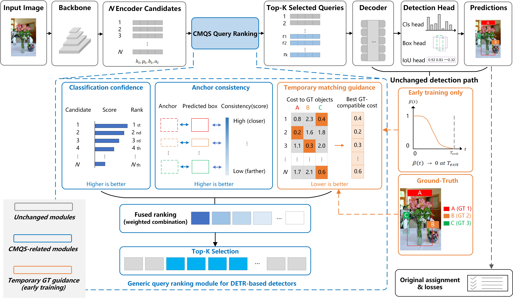

# Curriculum Matching-Aware Query Selection for Real-Time DETR-Based Object Detection
[](https://doi.org/10.5281/zenodo.20815314)

This repository provides the source code, experimental configurations, model weights, training logs, reproducibility protocols, analysis utilities, and result tables associated with the manuscript:

**Curriculum Matching-Aware Query Selection for Efficient End-to-End Object Detection**

**Authors:** Zhipeng Zou, Guowei Zhang, Yong Han, and Zhida Ke
**Submitted to:** *The Visual Computer*

> **GitHub repository:** CMQS-DEIM
> **Archived release corresponding to the revised manuscript:** `v1.0.0`
> **Software release DOI (v1.0.0):** `10.5281/zenodo.20815315`
> **DOI for all versions:** `10.5281/zenodo.20815314`
>
> **Release assets.** The GitHub `v1.0.0` release provides the DEIM-S and DEIM-L CMQS checkpoints and their corresponding verified training logs. The released model weights, logs, configurations, and reported experimental results remain unchanged. Subsequent commits on the `main` branch contain documentation, licensing, and attribution clarifications.




## Main results and released models

CMQS improves the locally re-implemented DEIM baseline at both evaluated model scales. The S-scale model improves from **49.11 AP to 49.27 AP**, while the L-scale model improves from **54.37 AP to 54.58 AP**.

| Model | Epochs | AP | AP50 | AP75 | APs | APm | APl | ΔAP | Config | Checkpoint | Training logs |
|---|---:|---:|---:|---:|---:|---:|---:|---:|---|---|---|
| DEIM-S baseline | 132 | 49.11 | 66.1 | 53.2 | 30.0 | 52.4 | 66.0 | – | [config](configs/deim_dfine/deim-s-baseline.yml) | upstream/local baseline | – |
| **DEIM-S + CMQS** | 132 | **49.27** | **66.3** | **53.3** | **30.6** | **52.6** | 66.0 | **+0.16** | [config](configs/deim_dfine/deim-s-cmqs.yml) | [download](https://github.com/Osiris-zou/CMQS-DEIM/releases/download/v1.0.0/cmqs_deim_s_best.pth) | [download](https://github.com/Osiris-zou/CMQS-DEIM/releases/download/v1.0.0/cmqs_deim_s_logs.txt) |
| DEIM-L baseline | 58 | 54.37 | 72.2 | 59.0 | 37.9 | 59.1 | 71.6 | – | [config](configs/deim_dfine/deim-l-baseline.yml) | upstream/local baseline | – |
| **DEIM-L + CMQS** | 58 | **54.58** | **72.3** | **59.2** | **38.4** | 58.9 | 71.3 | **+0.21** | [config](configs/deim_dfine/deim-l-cmqs.yml) | [download](https://github.com/Osiris-zou/CMQS-DEIM/releases/download/v1.0.0/cmqs_deim_l_best.pth) | [download](https://github.com/Osiris-zou/CMQS-DEIM/releases/download/v1.0.0/cmqs_deim_l_logs.txt) |

The corresponding machine-readable values are stored in [results/table1_accuracy.csv](results/table1_accuracy.csv) and [results/table2_recall.csv](results/table2_recall.csv). The released checkpoints correspond to the best-recorded validation AP under the same selection rule used in the manuscript.

## Method summary

CMQS aligns encoder candidate-query ranking with the matching-based supervision used later in DETR-style training. For each candidate query, it combines:

- classification confidence;
- anchor/proposal-based geometric stability;
- a curriculum-weighted minimal Hungarian-style matching cost.

The GT-dependent cost term is used only during early training. It is disabled at and after the configured exit epoch and is never used during inference.

## Runtime integration

This repository is a **complete overlay for the upstream DEIM codebase**, rather than a redistributed copy of the full DEIM project. The three runtime files required for the curriculum schedule are included:

```text
engine/solver/det_engine.py   -> passes epoch to the detector
engine/deim/deim.py           -> forwards epoch to the decoder
engine/deim/dfine_decoder.py  -> computes CMQS ranking and beta(t)
```

The explicit chain is:

```text
det_engine.py -> model(..., epoch=epoch) -> DEIM.forward -> decoder(..., epoch=epoch)
```

This prevents an accidental fallback to epoch 0 and ensures that $\beta(t)$ and $T_{\mathrm{exit}}$ follow the configured schedule.

## Main settings

| Model | $\alpha$ | $\gamma$ | $\beta_0$ | $T_{\mathrm{exit}}$ | Cost weights |
|---|---:|---:|---:|---:|---:|
| DEIM-S + CMQS | 1.0 | 0.2 | 0.2 | 24 | 2 / 5 / 2 |
| DEIM-L + CMQS | 1.0 | 0.2 | 0.2 | 10 | 2 / 5 / 2 |

The GT-dependent matching-cost term is active only while `epoch < query_select_gt_stop_epoch`. It is disabled at and after the exit epoch and during inference.

## Repository layout

```text
configs/deim_dfine/     Main DEIM-S/DEIM-L baseline and CMQS configs
configs/ablations/      Table 4-6 ablation and sensitivity configs
engine/deim/            Modified decoder and DEIM wrapper
engine/solver/          Modified training engine with epoch propagation
results/                CSV values reported in Tables 1, 2 and 4-9
tools/                  Profiling, plotting, query visualization and validation
scripts/                Patch, train, evaluate, seed-pair and release scripts
docs/                   Reproduction, model-zoo, table mapping and release notes
checkpoints/            Checkpoint availability and naming instructions
logs/                   Training-log availability and naming instructions
release_assets/         Exact GitHub Release filenames and checksum template
```

## Environment

The exact historical package freeze used for the reported experiments was not preserved. The included `environment.yml` and `requirements.txt` therefore describe a compatible reference software stack rather than an exact frozen environment.

For future reruns, `scripts/export_environment.sh` can be used to record a complete Conda environment, Python package freeze, and system information. See [docs/environment.md](docs/environment.md) for details.

## Quick start

### 1. Prepare upstream DEIM

Clone or prepare the upstream DEIM codebase and apply this overlay:

```bash
bash scripts/apply_cmqs_patch.sh /path/to/DEIM
cd /path/to/DEIM
bash scripts/preflight_check.sh
```

The patch script backs up the three replaced core files before copying CMQS files.

### 2. Prepare COCO 2017

```text
datasets/coco/
├── train2017/
├── val2017/
└── annotations/
    ├── instances_train2017.json
    └── instances_val2017.json
```

Update the upstream DEIM dataset configuration when your paths differ.

### 3. Train the main experiments

Set the corresponding upstream DEIM initialization checkpoint:

```bash
export PRETRAIN=/path/to/deim_checkpoint.pth
```

DEIM-L:

```bash
bash scripts/train_deim_l_baseline.sh 42
bash scripts/train_deim_l_cmqs.sh 42
```

DEIM-S:

```bash
# Set PRETRAIN to the DEIM-S initialization checkpoint first.
bash scripts/train_deim_s_baseline.sh 42
bash scripts/train_deim_s_cmqs.sh 42
```

Each training script writes terminal output to a unique `console.log` through `tee` and returns the original `torchrun` exit code.

### 4. Download and evaluate the released CMQS checkpoints

Download the released CMQS checkpoints and training logs:

```bash
bash scripts/download_released_models.sh
```

Evaluate DEIM-L:

```bash
bash scripts/eval_checkpoint.sh \
  configs/deim_dfine/deim-l-cmqs.yml \
  checkpoints/cmqs_deim_l_best.pth
```

Evaluate DEIM-S:

```bash
bash scripts/eval_checkpoint.sh \
  configs/deim_dfine/deim-s-cmqs.yml \
  checkpoints/cmqs_deim_s_best.pth
```

Do not combine `--resume` and `--tuning`.

### 5. Paired seed-level experiments

```bash
bash scripts/run_seed_pair.sh 42
bash scripts/run_seed_pair.sh 3407
bash scripts/run_seed_pair.sh 2024
```

The seed-level analysis remains available as complementary stability evidence. Its machine-readable values are stored in [results/table9_seed_stability.csv](results/table9_seed_stability.csv).

### 6. Run an ablation

```bash
bash scripts/run_ablation.sh table4_classification_cost_curriculum 42
bash scripts/run_ablation.sh table5_beta_02 42
bash scripts/run_ablation.sh table6_exit_10 42
```

See `configs/ablations/` and [docs/table_mapping.md](docs/table_mapping.md) for the complete mapping.

### 7. Reproduce plots and analyses

Figure 4:

```bash
python tools/plot_figure4_convergence.py \
  --deim-s-log /path/to/deim_s_baseline/log.txt \
  --cmqs-s-log /path/to/deim_s_cmqs/log.txt \
  --deim-l-log /path/to/deim_l_baseline/log.txt \
  --cmqs-l-log /path/to/deim_l_cmqs/log.txt
```

Figure 5:

```bash
python tools/plot_figure5_sensitivity.py
```

Table 7 and Figures 6-7 are documented in [docs/reproduction.md](docs/reproduction.md).

## Reported result files

The `results/` directory contains machine-readable CSV values for the manuscript tables. These files make the reported numbers auditable and complement the released S- and L-scale model checkpoints and logs.

## Data, checkpoints and logs

The COCO 2017 dataset and upstream DEIM initialization checkpoints are not redistributed because they remain subject to their original licenses and access conditions. This repository provides:

- exact DEIM-S and DEIM-L CMQS configurations;
- the reported S- and L-scale CMQS checkpoints through the GitHub Release;
- the corresponding training logs through the GitHub Release;
- machine-readable result tables;
- training, evaluation, profiling and visualization scripts.

See [checkpoints/README.md](checkpoints/README.md), [logs/README.md](logs/README.md) and [release_assets/README.md](release_assets/README.md).

## Citation

If you use this code, released checkpoints, experimental protocol, or metadata, please cite the software release and the associated manuscript.

```bibtex
@software{zou2026cmqs_deim,
  author  = {Zou, Zhipeng and Zhang, Guowei and Han, Yong and Ke, Zhida},
  title   = {CMQS-DEIM: Curriculum Matching-Aware Query Selection for Efficient End-to-End Object Detection},
  year    = {2026},
  version = {1.0.0},
  doi     = {10.5281/zenodo.20815315},
  url     = {https://doi.org/10.5281/zenodo.20815315},
  note    = {Software associated with a manuscript submitted to The Visual Computer}
}
```

Associated manuscript:

> Zou, Z., Zhang, G., Han, Y., and Ke, Z.  
> *Curriculum Matching-Aware Query Selection for Efficient End-to-End Object Detection.*  
> Manuscript submitted to *The Visual Computer*.

The software release has been archived on Zenodo. The manuscript citation will be updated with the final article DOI and bibliographic details if the article is published. Please also cite the upstream DEIM work.

## License

CMQS-DEIM is distributed under the Apache License, Version 2.0.

This repository contains files derived from and modified from the upstream DEIM project, which is also distributed under the Apache License, Version 2.0. Applicable upstream copyright, license, and attribution notices have been retained, and modified upstream files include notices describing the CMQS-DEIM changes.

See [LICENSE](LICENSE) for the complete license text, [NOTICE](NOTICE) for attribution and modification information, and [THIRD_PARTY_LICENSES.md](THIRD_PARTY_LICENSES.md) for information about third-party software, datasets, pretrained checkpoints, and dependencies.

The repository license does not grant rights to the COCO dataset, third-party pretrained checkpoints, trademarks, or other external assets. Those materials remain subject to their respective licenses and terms.

## Upstream DEIM

CMQS-DEIM is implemented as a modification and reproducibility overlay of the official DEIM project. The exact historical upstream commit used for the original experiments was not preserved. The released implementation has been checked against DEIM commit `bc11dfefc08d79756508c7f8b56c29feb909a4f0`.

See [docs/upstream_version.md](docs/upstream_version.md) and [docs/changelog_from_deim.md](docs/changelog_from_deim.md) for details.
